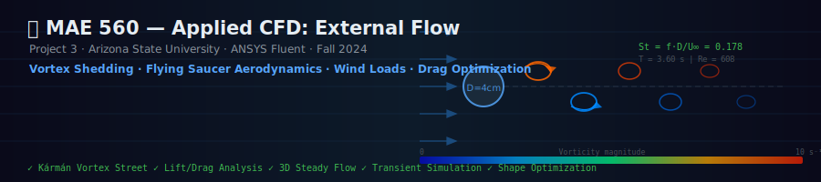
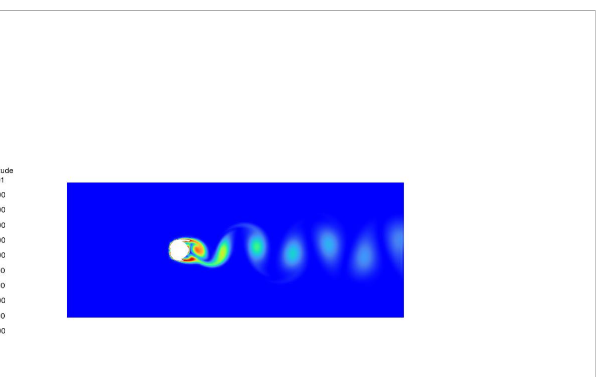
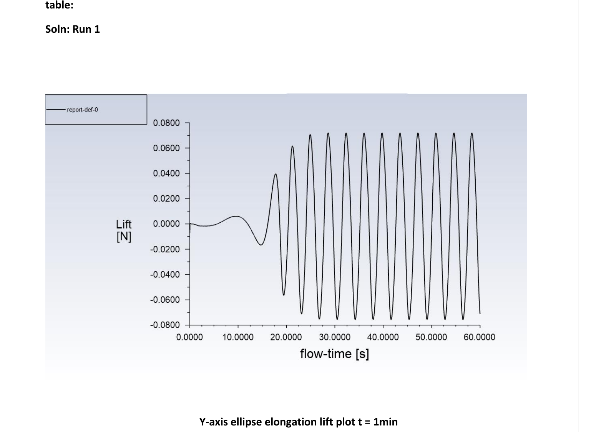
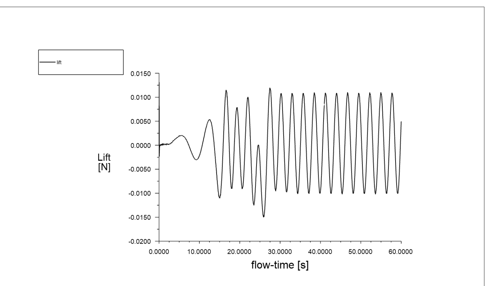
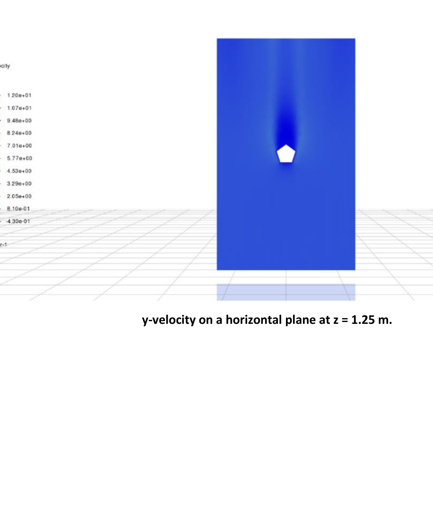
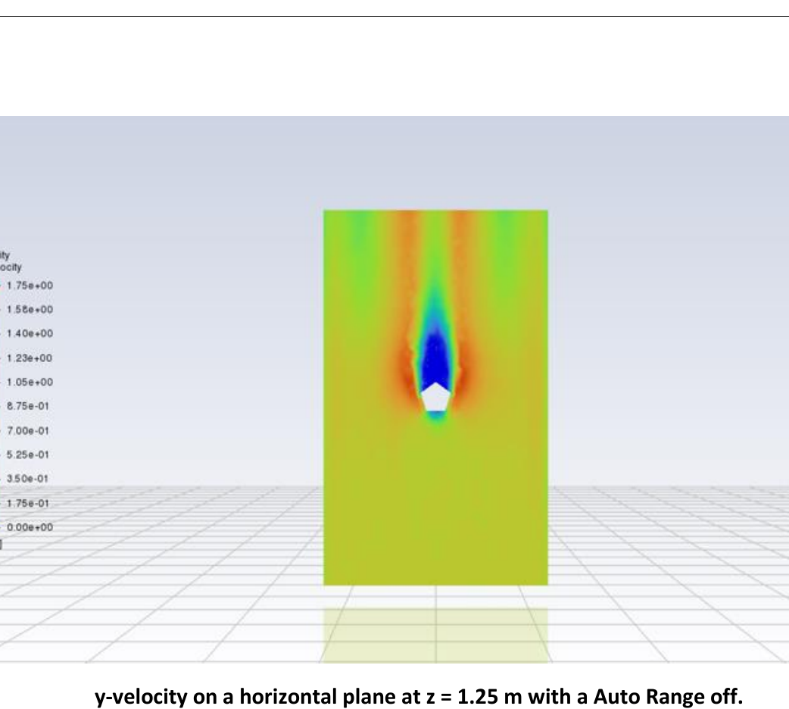
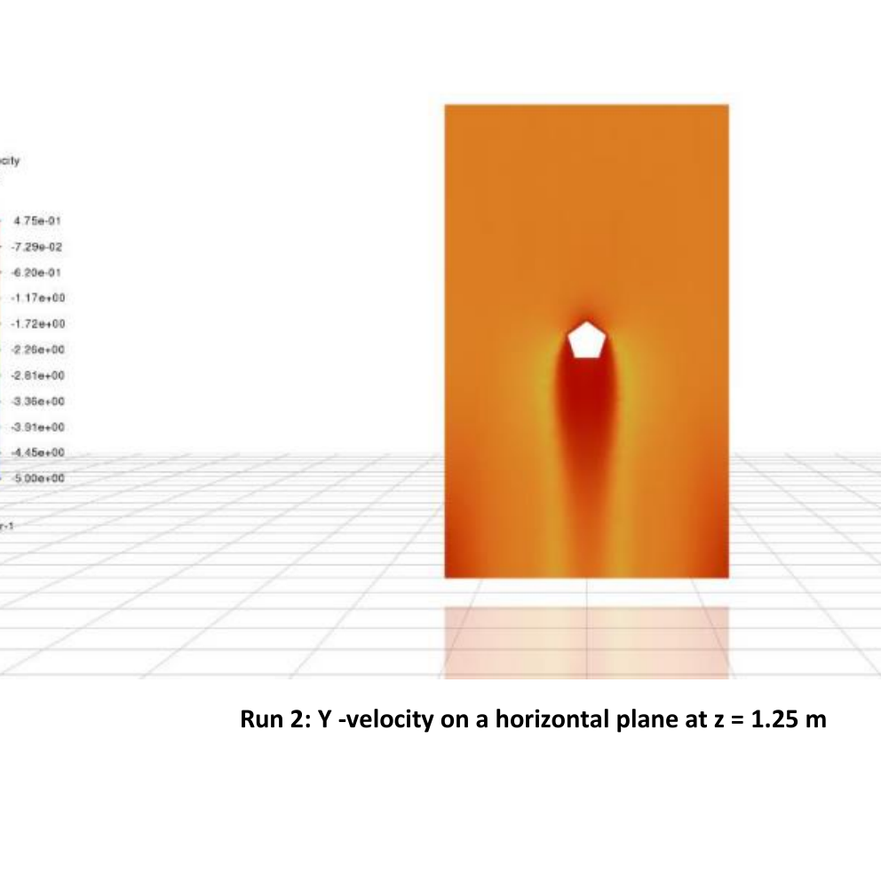
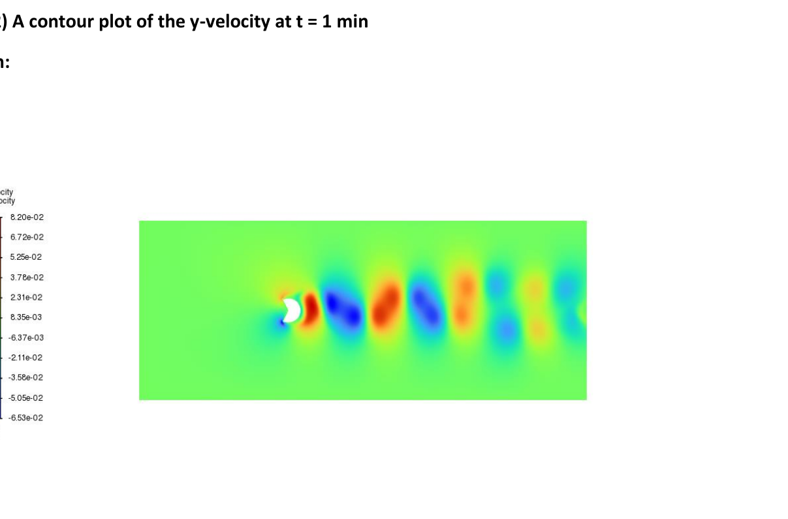
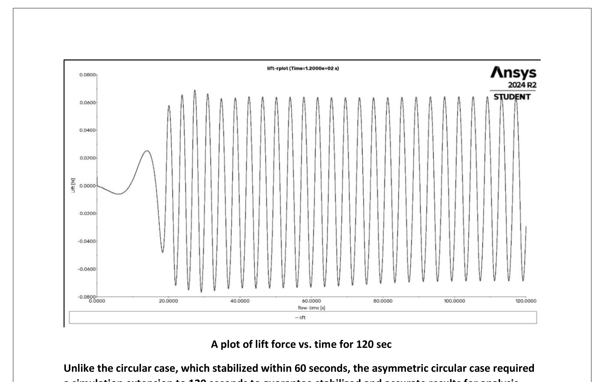

<div align="center">



Applied Computational Fluid Dynamics  
External Flow  
**Tool:** ANSYS Fluent 2024 R2  
**Author:** Vaishanavi Sogalad 

</div>

---

##  What Is This Project? (The Big Picture)

This project utilizes **ANSYS Fluent** to simulate fluid flow around objects, known as **external flow**, similar to wind blowing around a building or water flowing past a submarine. Unlike flow inside a pipe, external flow creates complex wakes, vortices, and oscillating forces that must be carefully analyzed.

The project covers **four distinct physical problems**, each building on the previous:

| Task | Problem | What You Learn |
|---|---|---|
| **1** | Flow past cylinders (circular + elliptical) | Vortex shedding, Strouhal number, lift oscillations |
| **2** | Flow past a tilted flying saucer | 3D aerodynamics, lift vs. drag trade-off with angle |
| **3** | Wind flow around a building | Real-world wind engineering, pressure distributions |
| **4** | Custom asymmetric cylinder (MAE 560 only) | Shape effects on vortex shedding amplitude |

---

##  Target Learning Areas

By completing this project, you develop skills in:

**1. CFD Workflow in ANSYS Fluent**
- Setting up geometry and boundary conditions (inlet velocity, outlet, no-slip walls)
- Choosing mesh resolution and time step size for transient simulations
- Post-processing contour plots, streamlines, and force monitors

**2. Vortex Shedding & the Strouhal Number**
- Understanding how cylinders shed alternating vortices (the **Kármán vortex street**)
- Measuring the **Strouhal number** from lift oscillation frequency
- Seeing how the cross-sectional shape dramatically changes shedding amplitude

**3. Aerodynamic Forces**
- Computing lift and drag from Fluent's force reports
- Separating **pressure drag** (dominant at Re ~ 600) from **viscous drag**
- Understanding how tilt angle creates massive increases in both lift and drag

**4. 3D External Flow Analysis**
- Interpreting velocity and pressure contours on planes of symmetry
- Understanding how building geometry redirects and accelerates wind
- Comparing flows with opposite inlet directions

**5. Reynolds Number Regime**
- Working in the **laminar-to-transitional** regime (Re ≈ 600)
- Understanding why the flow is time-dependent (transient) rather than steady

---

##  Key Equations

### Reynolds Number
$$Re = \frac{\rho \, v \, D}{\mu}$$

The dimensionless ratio of inertial to viscous forces. Determines whether flow is laminar, transitional, or turbulent.

| Symbol | Meaning | Value Used |
|---|---|---|
| ρ | Fluid density | 730 kg/m³ |
| v | Inlet velocity | 0.05 m/s |
| D | Cylinder diameter | 0.04 m |
| μ | Dynamic viscosity | 0.0024 kg/m·s |
| **Re** | **Reynolds number** | **608.33** |

> At Re ≈ 608, flow is in the **laminar vortex shedding** regime, periodic and predictable, but unsteady.

---

### Strouhal Number
$$St = \frac{f \cdot D}{U_\infty}$$

Dimensionless shedding frequency. For a circular cylinder at Re ~ 600, St ≈ 0.2 is expected.

$$f = \frac{1}{T} = \frac{1}{3.60} = 0.278 \text{ Hz} \quad \Rightarrow \quad St = \frac{0.278 \times 0.04}{0.05} \approx 0.222$$

---

### Lift Force Amplitude
$$\text{Amplitude} = \frac{F_{max} - F_{min}}{2}$$

Used to characterize the strength of oscillating lift from vortex shedding.

---

### Lift and Drag (Pressure + Viscous)
$$F_{drag} = F_{drag,pressure} + F_{drag,viscous}$$
$$F_{lift} = F_{lift,pressure} + F_{lift,viscous}$$

At low Reynolds numbers, viscous drag is significant. At Re ~ 600, pressure drag dominates (~99% of total).

---

##  Simulation Setup

| Parameter | Value |
|---|---|
| Solver | ANSYS Fluent (pressure-based, transient) |
| Fluid | Oil (ρ = 730 kg/m³, μ = 0.0024 kg/m·s) |
| Inlet velocity | 0.05 m/s |
| Cylinder diameter | 0.04 m |
| Mesh resolution | 0.004 m |
| Time step size | 0.03 s |
| Max iterations/step | 20 |
| Total time steps | 2000 (= 60 seconds) |

---

## 📋 Task 1 — Vortex Shedding Past Cylinders (2D Transient)

### What Is Vortex Shedding?

When fluid flows past a bluff body (like a cylinder), it cannot smoothly follow the curved surface. The flow **separates** and forms alternating swirling vortices downstream of the famous **Kármán vortex street**. These cause an oscillating **lift force** perpendicular to the flow direction, even though the cylinder isn't moving.

This is the same phenomenon that caused the **Tacoma Narrows Bridge** to oscillate and collapse in 1940.

```
         ↑ Lift oscillates ↑↓
 →→→→  ○  ~●~●~●~●~●~  → →→→
 →→→→     (vortex street)
         ↓ Lift oscillates ↑↓
```

### Mesh Setup


*The 2D computational domain with a velocity inlet (left), pressure outlet (right), and the cylinder centered in the domain. Green region = structured mesh; arrows show inlet flow direction.*

---

### Flow Visualization at t = 1 min

#### Y-Velocity Contour


*Y-velocity (perpendicular to flow) reveals the alternating up/down motion of shed vortices. Red = upward flow, Blue = downward flow. The alternating pattern clearly shows the Kármán vortex street.*

---

#### Stream Function


*The stream function shows mass flow per unit width. Lines of constant stream function are streamlines — the gradient from blue (bottom) to red (top) shows the smooth bypass of fluid around the cylinder.*

---

#### Vorticity Magnitude


*Vorticity magnitude (|∇ × **V**|) in s⁻¹ shows the spinning intensity of fluid elements. The highest vorticity (red/orange) is right behind the cylinder where shear layers form. The vortices decay as they travel downstream (blue blobs).*

> **Physical insight:** The two columns of alternating vortices — one rotating clockwise, one counterclockwise — create an oscillating side force (lift) on the cylinder at the shedding frequency.

---

### Lift Force vs. Time — Circular Cylinder


*Lift force oscillates between ±0.041 N once the flow is fully established (~30 seconds spin-up). The initial transient dies out and the signal becomes periodic.*

| Quantity | Value |
|---|---|
| Maximum lift | +0.0400 N |
| Minimum lift | −0.0410 N |
| **Amplitude** | **0.0405 N** |
| **Period** | **3.60 s** |

---

### Effect of Cylinder Shape (Elliptical Cross-Sections)

**Run 1 — Ellipse elongated along Y-axis** (taller than wide → bluffer body):



*Taller cross-section creates a larger separated wake → stronger vortices → higher lift amplitude.*

**Run 2 — Ellipse elongated along X-axis** (wider than tall → more streamlined):



*Streamlined shape reduces flow separation → weaker vortices → dramatically lower lift amplitude.*

### Comparison Summary

| Shape | Amplitude (N) | Period (s) | Physical Reason |
|---|---|---|---|
| Circular cylinder | 0.0405 | 3.60 | Baseline case |
| Ellipse (Y-elongated) | **0.0765** | 3.92 | Larger frontal area → stronger shedding |
| Ellipse (X-elongated) | **0.0149** | 3.37 | Streamlined → weaker separation |

> **Key finding:** Making an object **streamlined** (X-elongated) reduces vortex shedding amplitude by **63%** compared to a circle. Making it **bluffer** (Y-elongated) increases it by **89%**. Shape is everything in external flow design.

---

##  Task 2 — Flying Saucer Aerodynamics (3D Steady)

### Problem Setup

A flying-saucer-shaped body is placed in a 3D domain and tilted at three angles: **θ = 0°, 25°, 50°**. For each angle, ANSYS Fluent computes the lift and drag forces using a **steady-state** simulation. The mesh uses adaptive refinement near the body surface where velocity gradients are steep.

### Mesh at θ = 50°


*The triangular mesh is refined in the wake region (behind the body) and near the surface. Finer cells capture the sharp velocity gradients near the leading and trailing edges.*

---

### X-Velocity Contours — Effect of Tilt Angle

#### θ = 0° (Level flight)


*At zero tilt, the saucer acts like a flat plate aligned with flow. A small separation region forms behind the trailing edge. Velocity accelerates symmetrically over the top and bottom surfaces.*

---

#### θ = 25° (Moderate tilt)


*At 25°, strong flow acceleration over the upper surface (orange/red) creates a low-pressure zone → significant lift. A growing recirculation zone forms on the leeward side.*

---

#### θ = 50° (High tilt)


*At 50°, massive flow separation occurs on the leeward face (large blue region = recirculation/reverse flow). Drag increases dramatically. The saucer is now acting more like a flat plate perpendicular to flow.*

---

### Lift and Drag vs. Tilt Angle

| Tilt Angle | Lift Force (N) | Drag Force (N) | L/D Ratio |
|---|---|---|---|
| θ = 0° | 3.4225 | 2.7200 | 1.26 |
| **θ = 25°** | **37.754** | **12.727** | **2.97** ← best efficiency |
| θ = 50° | 25.136 | 40.591 | 0.62 |

> **Key finding:** Maximum lift occurs at θ = 25°. At θ = 50°, drag explodes (15× increase from 0°) while lift actually decreases — the saucer has "stalled." The optimal tilt for maximum lift-to-drag ratio is around **θ = 25°**, analogous to the optimal angle of attack for an airfoil.

---

##  Task 3 — Wind Loads on a Building (3D Steady)

### Problem Setup

A simplified building model is placed in a 3D atmospheric domain. Two runs are performed with **opposite inlet directions** (wind from the front vs. wind from the side/behind). The horizontal plane at **z = 1.25 m** (mid-height of the building) is analyzed.

### Run 1 — Flow Results

**Y-Velocity (Run 1):**



*The building deflects wind sideways. High y-velocity values (red) at the building corners show wind being accelerated around the edges — this is the "corner acceleration" effect common in urban wind engineering.*



*With auto-range off, the thin high-velocity jets at the building corners become clearly visible. The narrow wake directly behind the building shows a low-velocity recirculation zone.*

**Static Pressure (Run 1):**


*High pressure (red) on the windward face — this is the stagnation pressure from the incoming wind. Low pressure (blue/green) in the wake creates suction on the leeward face. The net pressure difference is what causes drag on the building.*

---

### Run 2 — Reversed Flow Direction

**Y-Velocity (Run 2):**



*With the flow reversed, the large orange wake region extends much further downstream, indicating stronger separation with this wind direction.*

### Drag Force Summary

| | Total Drag (N) | Pressure Term (N) | Viscous Term (N) |
|---|---|---|---|
| **Run 1** | 3.3537 | 3.5379 | 0.0289 |
| **Run 2** | −4.7407 | −4.7240 | −0.0168 |

> **Note on Run 2 sign:** The negative sign in Run 2 indicates the force acts in the **negative y-direction**, consistent with the reversed flow. The magnitude 4.74 N is larger than Run 1's 3.35 N, meaning the reversed flow direction produces ~41% more drag — highlighting how building orientation relative to prevailing wind matters enormously for structural loading.

> **Pressure dominates drag:** In both runs, the pressure term accounts for ~99% of total drag. Viscous skin friction is negligible for bluff bodies at these Reynolds numbers — all the drag comes from the pressure difference between windward and leeward faces.

---

##  Task 4 — Asymmetric Cylinder Design (MAE 560 Only)

### The Challenge

Design a custom **asymmetric cylinder** that fits within a 4cm × 4cm bounding box, simulate the vortex shedding, and compare the lift amplitude to the baseline circular case.

### Geometry


*The asymmetric cross-section breaks left-right symmetry, causing unequal pressure distributions on the two sides of the cylinder.*

---

### Y-Velocity Contour at t = 1 min



*The asymmetric shape creates a less regular vortex pattern compared to the circular case — the alternating vortices are unevenly spaced, reflecting the asymmetric pressure distribution.*

---

### Lift Force vs. Time

**First 60 seconds:**


*Unlike the circular case which stabilized by ~30s, the asymmetric cylinder has not yet reached steady-state oscillation at 60 seconds.*

**Extended to 120 seconds:**



*Extending the simulation to 120 seconds reveals the fully established periodic oscillation. The asymmetric shape requires longer spin-up time to develop a stable shedding pattern.*

### Results

| Quantity | Value |
|---|---|
| Maximum lift | +0.0605 N |
| Minimum lift | −0.0743 N |
| **Amplitude** | **0.0674 N** |
| **Period** | **4.04 s** |

### Comparison with Circular Case

| Geometry | Amplitude (N) | Period (s) | vs. Circular |
|---|---|---|---|
| Circular cylinder | 0.0405 | 3.60 | Baseline |
| Asymmetric cylinder | 0.0674 | 4.04 | **+66.4% higher amplitude** |

> **Why is the amplitude higher?** The geometric asymmetry creates **unequal pressure on the two sides** of the cylinder even without any flow asymmetry. This breaks the natural symmetry of the vortex shedding process, intensifying the alternating pressure fluctuations and producing a stronger oscillatory lift force. The longer period (4.04 s vs. 3.60 s) also suggests the larger effective frontal area slows the shedding frequency slightly.

---

##  Key Findings Summary

| Task | Most Important Finding |
|---|---|
| **Task 1** | Cross-section shape controls vortex shedding amplitude: streamlined ellipse reduces it by 63%, bluff ellipse increases it by 89% |
| **Task 2** | Flying saucer at θ = 25° achieves best lift-to-drag ratio (L/D = 2.97); beyond 25° the flow stalls and drag dominates |
| **Task 3** | Building orientation strongly affects wind loads — reversed flow increases drag by ~41%. Pressure drag dominates (99%) over viscous drag |
| **Task 4** | Geometric asymmetry increases vortex shedding amplitude by 66% and requires longer simulation time to reach steady-state oscillation |

---

##  Tools & Software

- **ANSYS Fluent 2024 R2** — CFD solver (finite volume method)
- **ANSYS SpaceClaim** — Geometry creation
- **ANSYS Meshing** — Structured and unstructured mesh generation
- Navier-Stokes equations solved with pressure-velocity coupling (SIMPLE algorithm)
- Transient simulations use 2nd-order implicit time stepping

---


---

## 📄 License

Developed for academic purposes at Arizona State University. Free to reference with attribution.
